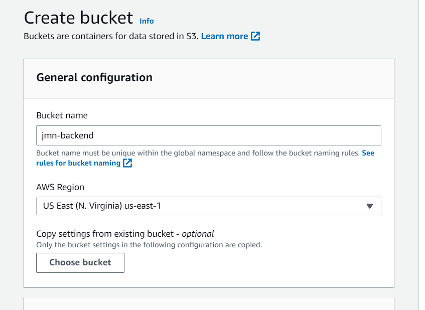
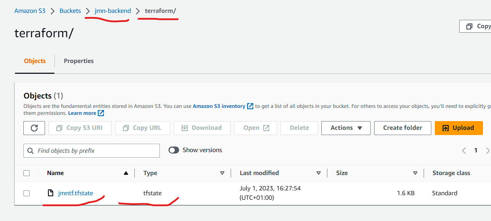

# Using an S3 bucket to save Terraform state file

This trial shows the steps in saving your terraform state file in the cloud so it doesn't get lost or corrupted. It can be a nightmare when managing a large amount of infrastrcture on terraform and the state file goes missing.

Created a `main.tf` file that includes the task terraform would run on amazon, which is creating a simple test VPC.

Created another file called `backup.tf`. In this file, we instruct terraform to upload the state file (jmntf.tfstate) to an S3 bucket, which already exists.

A successful run creates the state file in the preexisting S3 bucket. See screenshots below:

*Bucket Creation. Note that versioning can be applied to the bucket if desired.*

*State file uploaded*

