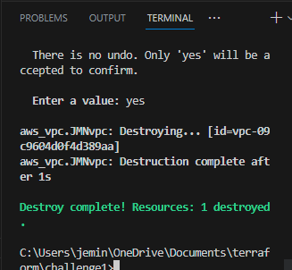

# Challenge 1

Creating a VPC called TerraformVPC and assigning a CIDR of 192.168.0.0/24. See `main.tf` file for info.

* Set the provider and region.
* Configured the resource type, resource name and CIDR block.
* Set the tag to call for the `var.vpcname` variable. This is what will prompt you to input the VPC name.
* Set up variable `vpcname` and set type as string.
* Run terraform plan and create resource.

* Confirm in AWS if resource is created.

* After confirming, use terraform to destroy resource.

