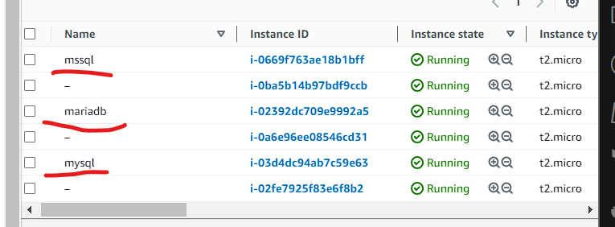
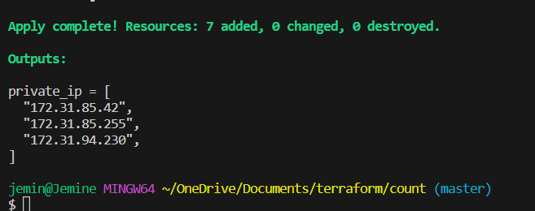

# Using the COUNT function in Terraform

The count function is used to specify the number of resources to be deployed. Instead of copying the resource block in several places, count is used to define how many should be deployed.

In this trial, I used count and modularization to deploy the previously done module challenge.

In `db.tf`, count is defined as a list instead of a number. I wanted terraform to create instances according to the number of names in a list. Notice a variable `server_names` was deployed and the type is set to `list(string).` This is now declared in the resource block to reference the `server_name` variable. Notice that the `Name` function also has the variable declared.

Since there are outputs that are dependent on the instances deployed, I added a wildcard to the `value` to accomodate the number of instances that would be deployed.

The `main.tf` file contains the provider, module and output information. The `server_names` are also declared here. See screenshot below of successful run:

*Deployed Resources*

*Terraform Output*

