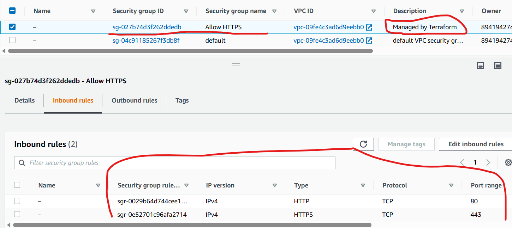
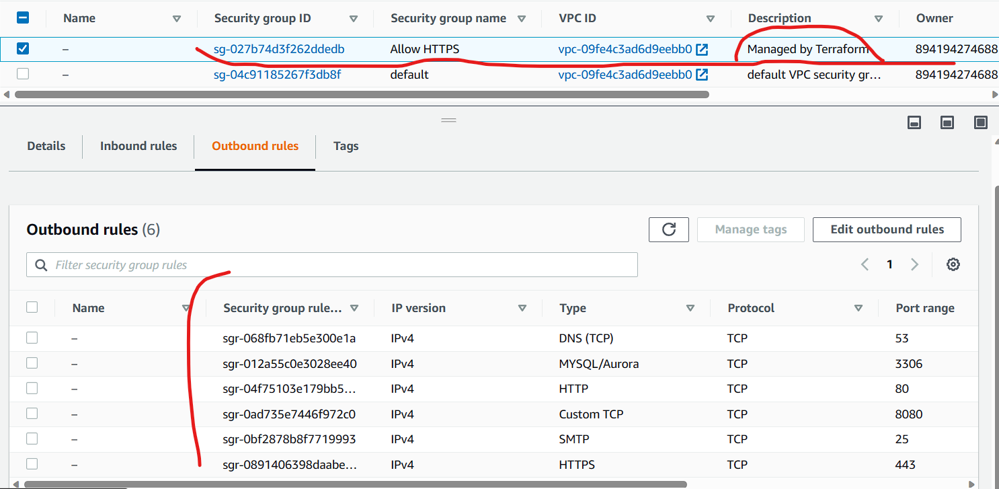

# Dynamic blocks on security groups

This is a continuation from the security groups hands-on. Imagine you have to configure security groups manually for a large number of instances. It would quickly turn into a nightmare.

Dynamic blocks are the way to solve the above situation. It is a way to dynamically set up security groups, instead of having to manually set them up individually. Dynamic blocks can be used in more than just security groups though.

In the `main.tf` file, the `for_each` loop goes through every element in the list (ingressrules and egressrules). After doing that, in the `dynamic "ingress" {` line notice there's an `iterator` command. It then iterates for the amount of ports that are present in the list, assigning the `from_port` and -to_port` values for each of the ports present in the list.

After the infrastructure is successfully created, it'll be seen in the AWS dashboard. See screenshots below:

