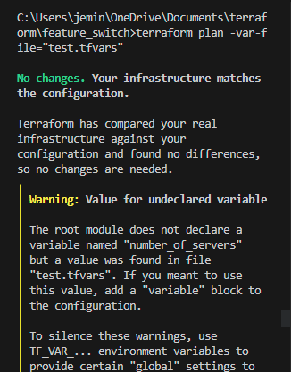
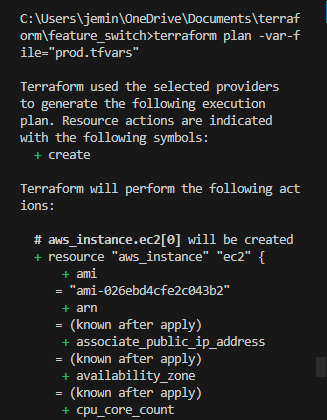

# Feature Switches

Feature switches are used when trying to deploy infrastructure on different environments. that is, you want to deploy to `test` and not to `prod` or vice versa.

The information in the `main.tf` file details how this is done. However the star of the show is the `count` function. The meaning of the command there is that if the environment to be deployed to is `prod`, create one ec2 instance, else do not create.

After the config files are set up, run `terraform init` and then `terraform plan -var-file="test.tfvars"`. The resource will not be created as the environment put here does not match the one configured in the `main.tf`. See below screenshot for info:

However, changing the command to `terraform plan -var-file="prod.tfvars"` returns successful. See screenshot below:

