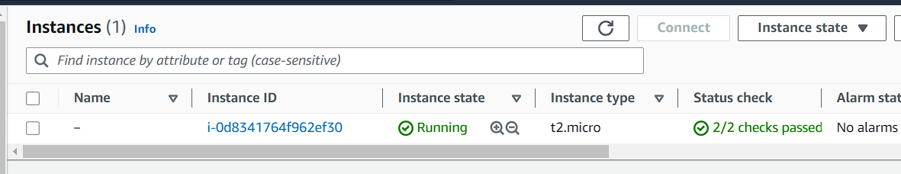
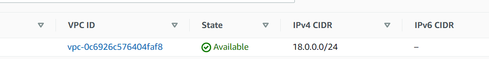
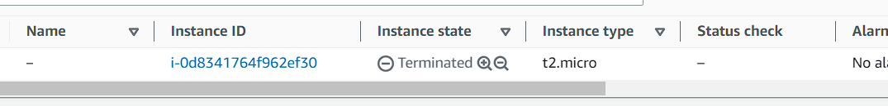
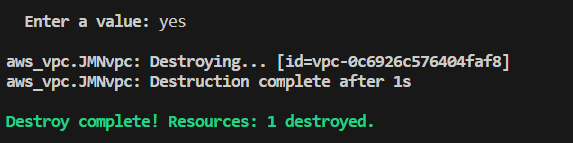

# Terraform Hands On

Trying out terraform to improve my skills. Successfully created and destroyed some instances on AWS using terraform. Check `main.tf` for info.

- Create EC2 instance

- Create VPC instance

- Destroy EC2 instance

- Destroy VPC instance

