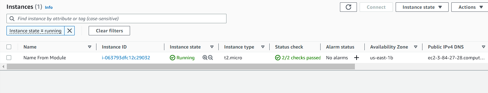
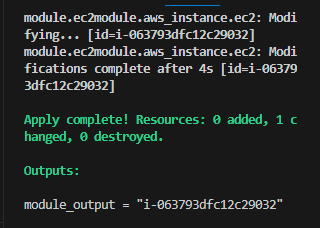

# Creating Multiple Instances A

The `main.tf` shows how to create multiple instances using the updated terraform version.

The `main.tf` file is also performing referencing on the `ec2.tf` file where the details of the component to be deployed is not declared directly in the `main.tf` file, but is referenced. (Kind of like Ansible referencing/static assignments).

# Creating Multiple Instances B

Updated this repo with another trial for modules. This time, I added `tags` and `output` arguments. See screenshots below:

*Created Instance*

*Displayed Output*

