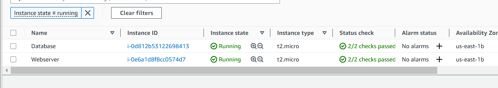
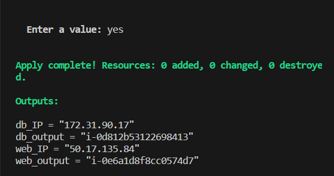

# Module Challenge

In this challenge, I modularized the previously done ec2 challenge where 2 instances were created for a webserver and db server, using dynamic blocks to set up a security groups and outputting the private IP of the db and the eip of the webserver. It also includes the step where the script was run on the webserver.

The `web.tf` file contains the desired config that would be udone for the webserver. It contains the resource info, EIP, security group details and public IP output.  An output for `instance_id` and a variable for `ec2name` was also declared here. The same was also done for the `db.tf`, with configurations for the database server. Instead out outputting the public IP address, the private IP address is used instead.

In the `main.tf` file, the provider details are provided and the modules are then created and referenced using values from the `web.tf` and `db.tf`.

The build was successful with the instances being deployed with the defined security group, the EIP was successfully attached to the webserver and the IP address was reachable from the browser. See screenshots below:

*Security Group*

*Running Instances*

*Terraform Outputs*

*Webpage*

