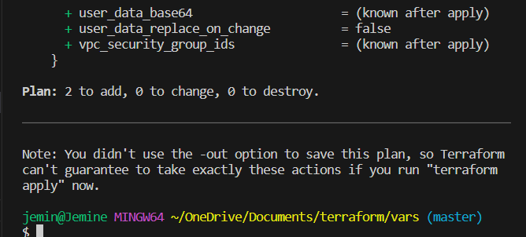
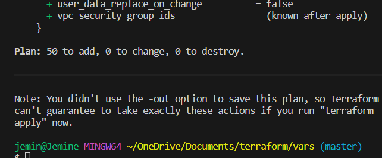

# Using Terraform to manage different environments

In this trial, I used terraform to seamlessly manage two environments I created. One for prod and another for test. It is typically not a good  idea to have two `main.tf` files for each environment. Using variables is a much better option.

In the `main.tf` file, I declared a variable called `number_of_servers`, which would reflect the number of instances I want to deploy depending on the environment. In test, there are 2 and in prod there are 50.

I ran `terraform plan -var-file=test.tfvars` to confirm and terraform showed that 2 instances would be created.

I did the same thing for prod and terraform confirmed that 50 would be created.

*Note that i used terraform plan to confirm the setup. I did not use terraform apply as I did not want to deploy 50 instances for obvious reasons*
